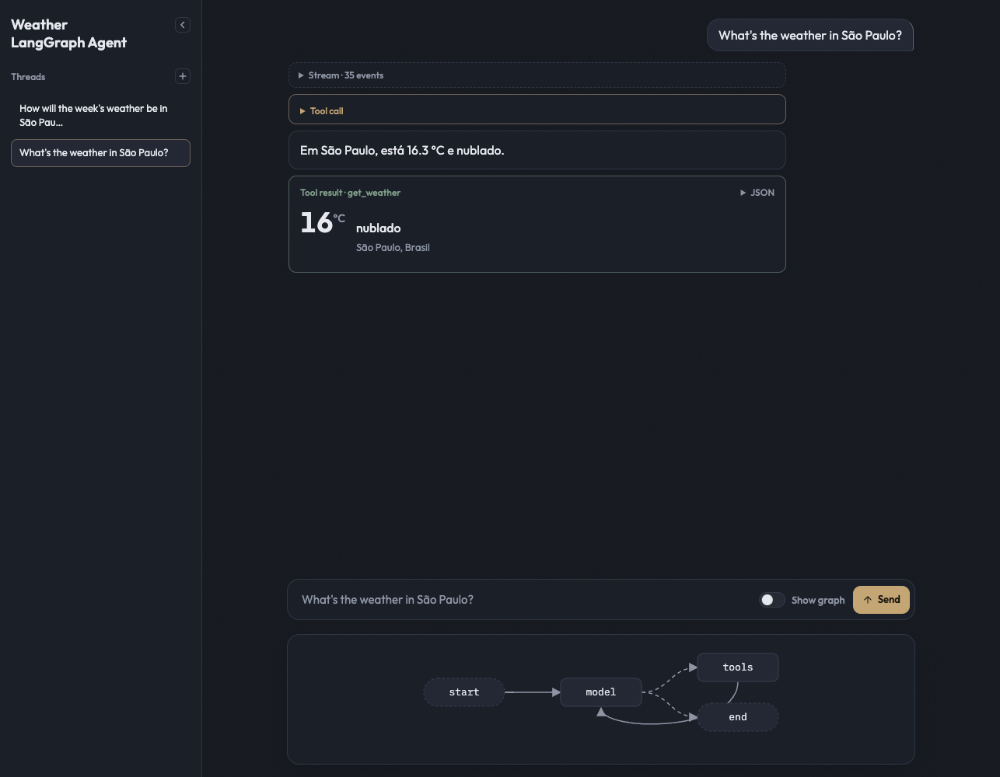
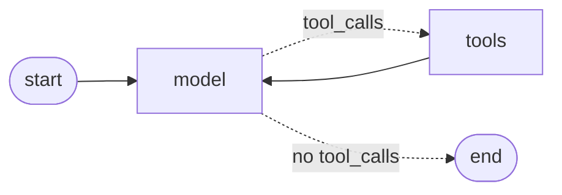

# Weather Agent

A LangGraph agent with a weather tool and an SSE chat. `POST /agent/execute` takes a
message, runs the graph (model ↔ tools) and streams the `astream_events` v2 `StreamEvent`s
back as `text/event-stream`. The front end reads the stream and paints each event type as
a separate state — tool call, final text, tool result — while highlighting the active
graph node.

**Live demo:** https://weather-agent-beta.vercel.app · **Source:** https://github.com/marcusbtc/weather-agent



The demo runs with no API key. Without `OPENAI_API_KEY` the agent falls back to
`FakeWeatherChatModel`: the graph, the tool, the event stream and the SSE are all real;
only the LLM is replaced. The front end is the same either way.

## What the UI does

- **Threads** live in a left sidebar. `+` starts a new thread. Clicking a thread restores
  its history. There is no server memory: each `POST /agent/execute` is still an
  independent run. The sidebar only snapshots the DOM in `localStorage`.
- **Collapse the sidebar** with the chevron. A 48px rail stays on the left so you can
  open the menu again.
- **Empty state** offers three chips (São Paulo now, the week's weather, hemisphere
  seasons). Each chip sends that prompt.
- **Show graph** (next to Send) hides the SVG under the composer. The choice is kept in
  `localStorage` as `weather-agent:graph-visible`.
- **Stream** and **Tool call** start collapsed so the sentence can lead.
- **Tool result** waits until that sentence finishes streaming, then appears below it.
  The weather card (temperature, condition, city) is on the card; **JSON** sits on the
  same header row and expands the raw payload.

## How it works



1. The user sends a message. Each `POST /agent/execute` is an independent execution — no
   memory between requests.
2. The **model** node decides. If it emits a tool call, the conditional edge goes to
   **tools**; the `ToolNode` runs `get_weather(city)` and returns to **model**, which now
   writes the final answer and the graph ends.
3. The agent streams every `chat_model` and `tool` event
   (`astream_events(version="v2", include_types=["chat_model", "tool"])`).
4. The HTTP layer wraps each `StreamEvent` as one SSE frame: `event:` is the event type,
   `data:` is the whole `StreamEvent` serialized with `langchain_core.load.dumps`.
5. The front end dispatches on the event type — `on_chat_model_*` or `on_tool_*`, anything
   else throws — and paints:
   - `on_chat_model_stream` tokens concatenate into a **draft** (text tokens as text,
     `tool_call_chunks` as the tool call being assembled: `get_weather({"city":"São Pa…`);
   - `on_chat_model_end` replaces that pass's draft with the **final text**, or with
     **tool call** blocks when the message has `tool_calls`;
   - `on_tool_start` marks the tool call as running; `on_tool_end` builds the **tool
     result** card but holds it until the next text pass finishes;
   - every event lights up its graph node (`metadata.langgraph_node`) and is listed in the
     **Stream** panel.

## Running locally

Requirements: Python 3.12+ and [`uv`](https://docs.astral.sh/uv/).

```bash
cp .env.example .env        # optional — see below
uv sync
uv run uvicorn weather_agent.main:app --reload
```

One process serves both: the API at `http://127.0.0.1:8000/agent/execute` and the front end
at `http://127.0.0.1:8000/`. Ask "What's the weather in São Paulo?" (or, in Portuguese,
"Qual o clima em São Paulo?") — or click a chip — and watch the tool call, the sentence
and the weather card appear in sequence. The graph is under the chat; turn **Show graph**
off if you want the drawing out of the way.

### Environment (`.env` at the repo root, gitignored)

| Variable          | Required | Default        | Notes                                                        |
| ----------------- | -------- | -------------- | ------------------------------------------------------------ |
| `OPENAI_API_KEY`  | no       | —              | Without it, the fake chat model is used.                     |
| `OPENAI_MODEL`    | no       | `gpt-5.4-mini` | Any OpenAI model with tool calling and streaming.            |
| `OPENAI_BASE_URL` | no       | OpenAI API     | Any OpenAI-compatible endpoint, e.g. OpenRouter.             |
| `MODEL_SOURCE`    | no       | —              | `fake` forces the fake model even when a key is set.         |
| `WEATHER_SOURCE`  | no       | `stub`         | `live` fetches real weather from Open-Meteo (no key needed). |

The `.env` file wins over variables already exported in your shell
(`load_dotenv(override=True)`).

`gpt-5.4-mini` is a reasoning-family model: it rejects `temperature`, so the agent sets
`reasoning_effort="none"` for the fastest first token.

**OpenRouter example**

```dotenv
OPENAI_API_KEY=sk-or-v1-...
OPENAI_BASE_URL=https://openrouter.ai/api/v1
OPENAI_MODEL=openai/gpt-5.4-mini
```

### The weather tool

By default `get_weather` is a stub (as the exercise requires): no HTTP, `sleep ~2s`, and
always

```json
{"city": "<city>", "temp_c": 22, "condition": "parcialmente nublado"}
```

With `WEATHER_SOURCE=live` it geocodes the city and reads the current temperature and WMO
weather code from [Open-Meteo](https://open-meteo.com/), keeping the same JSON shape. The
demo in the screenshot uses `live`.

### The fake chat model

`FakeWeatherChatModel` (`weather_agent/fake_model.py`) is a real LangChain `BaseChatModel`
with `_generate`, `_stream` and `_astream`. It does **not** call OpenAI. It does what a
real model would do in *this* graph, deterministically, so the rest of the stack can be
demoed and tested without a key.

**When it is used**

- no `OPENAI_API_KEY`, or
- `MODEL_SOURCE=fake` (even if a key is set).

The Vercel demo uses this path.

**What it does**

1. On the first pass (the last message is a human turn) it emits a `get_weather` tool
   call. The city is the text after `in` or `em` — "What's the weather in Lisbon?" →
   Lisbon; "Qual o clima em Curitiba?" → Curitiba; **São Paulo** if neither matches.
2. On the second pass (the last message is the tool result) it writes a one-line answer
   in the **question's** language:
   - English (`in …`): `In <city> it's <temp>°C, <condition>.`
   - Portuguese (`em …`, or no match): `Em <city> faz <temp>°C, <condition>.`
3. Tokens stream with a small delay (`token_delay`, default 0.04s) so the draft visibly
   grows — same event types as `ChatOpenAI`.

The tools always return the condition in Portuguese (the stub's `parcialmente nublado` is
fixed by the exercise). `weather_agent/conditions.py` translates that label for English
answers. The real model is told to do the same in its system prompt.

`bind_tools` is a no-op: the fake model always calls `get_weather`. It is not a general
chat model; it only walks this weather graph.

## API

```bash
curl -N -X POST http://127.0.0.1:8000/agent/execute \
  -H 'Content-Type: application/json' \
  -d '{"message": "What'\''s the weather in São Paulo?"}'
```

```
event: on_chat_model_stream
data: {"event": "on_chat_model_stream", "name": "ChatOpenAI", "data": {"chunk": {"lc": 1, ...}}, ...}

event: on_tool_start
data: {"event": "on_tool_start", "name": "get_weather", "data": {"input": {"city": "São Paulo"}}, ...}
```

`GET /agent/graph` returns the compiled graph's nodes and edges (`{nodes, edges}`, with
conditional edges flagged); the front end draws it as SVG.

## Tests

```bash
uv run pytest
```

Tool (stub and live routing), Open-Meteo client (mocked transport), graph routing, agent
event order, SSE encoding, the front↔back contract, and the HTTP routes — all with the fake
model, no network.

## Deploying to Vercel

The repo is ready for Vercel's Python runtime: `pyproject.toml` declares the entrypoint
(`[tool.vercel] entrypoint = "weather_agent.main:app"`), `vercel.json` sets `maxDuration`
and excludes tests, and `.vercelignore` keeps `.env` out. With no environment variables the
deployment runs the fake model and the stub tool; add `OPENAI_API_KEY` for a real model or
`WEATHER_SOURCE=live` for real weather.

```bash
vercel deploy --prod
```

## Project layout

```
weather_agent/
  tools.py        get_weather — stub (default) or live via WEATHER_SOURCE
  open_meteo.py   real weather client, only with WEATHER_SOURCE=live
  graph.py        StateGraph: model node ↔ tools node (ToolNode + tools_condition)
  agent.py        compiles the graph, streams astream_events v2, describes the graph
  fake_model.py   deterministic chat model used when there is no API key
  conditions.py   Portuguese → English condition labels for English answers
  sse.py          StreamEvent → SSE frame (event + data)
  main.py         POST /agent/execute, GET /agent/graph, static front end at /
web/
  index.html, styles.css, favicon.svg
  app.js          graph toggle, threads, empty chips; form → fetch POST → render
  sse.js          text/event-stream parser over fetch (POST, so no EventSource)
  renderers.js    event type → renderer (on_chat_model_* | on_tool_*), else throw
  view.js         blocks: draft, tool call, held tool result, final text; Stream panel
  graph.js        graph SVG (layered layout) and active node
tests/
docs/adr/         architecture decisions
CONTEXT.md        domain glossary
```

## Out of scope

Auth, server-side persistence/checkpoints (each message is an independent execution;
threads, sidebar and Show graph are browser-only), RAG, AG-UI, custom stream formats.
